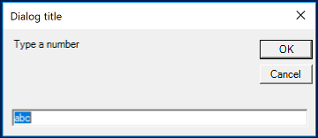
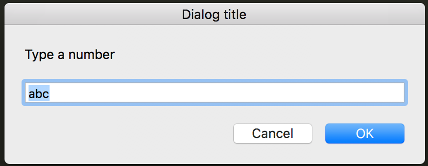
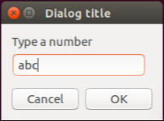

# About

[](https://godoc.org/github.com/martinlindhe/inputbox)

InputBox is a simple cross-platform library for displaying desktop dialog boxes in your go application


## Example

```go
package main

import "github.com/martinlindhe/inputbox"

func main() {
	got, ok := inputbox.InputBox("Dialog title", "Type a number", "abc")
	if ok {
		fmt.Println("you entered:", got)
	} else {
		fmt.Println("No value entered")
	}
}
```

### Windows

Uses a powershell script



### macOS

Uses a osascript




### Linux

Uses zenity (gtk)




### More

If you like this, check out https://github.com/martinlindhe/notify for cross-platform desktop notifications.


### License

Under [MIT](LICENSE)
